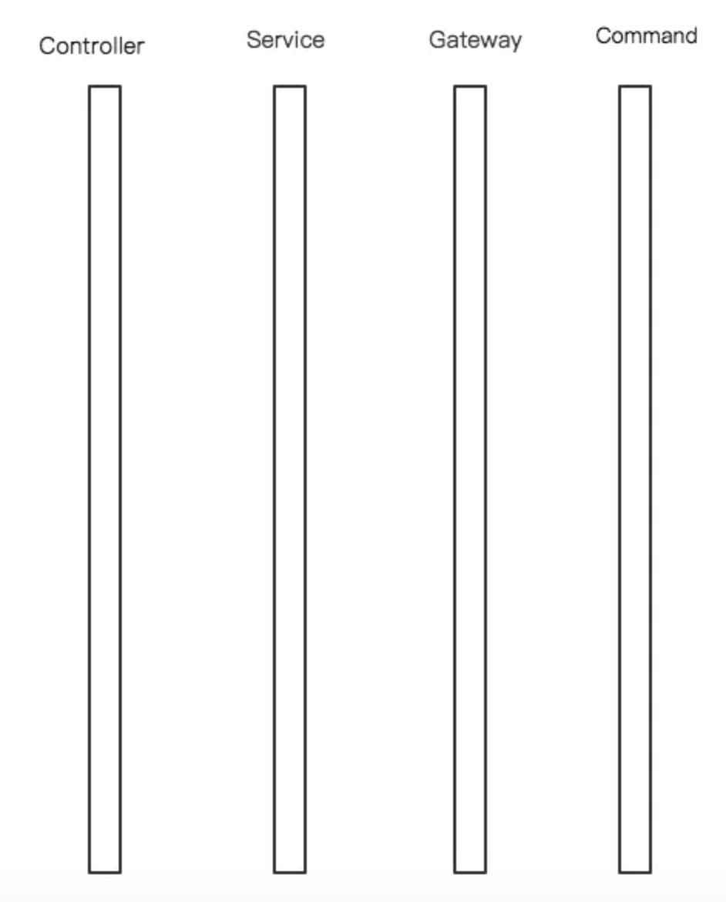
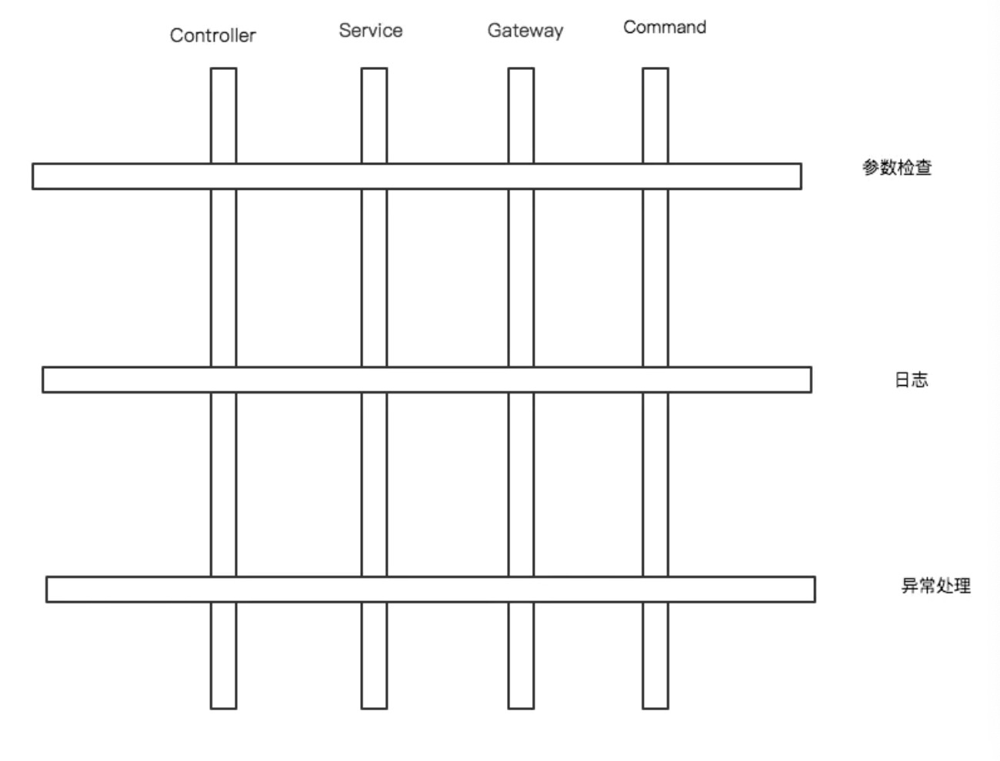
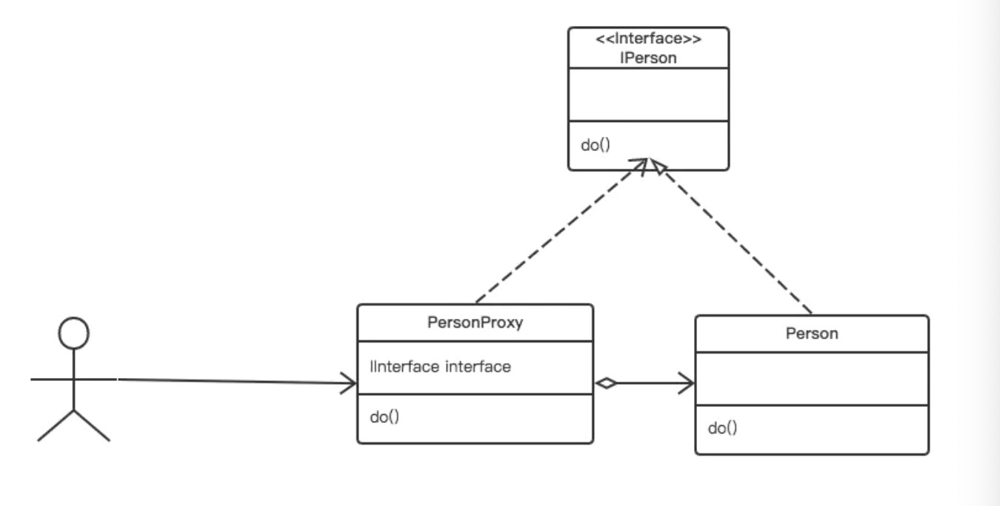
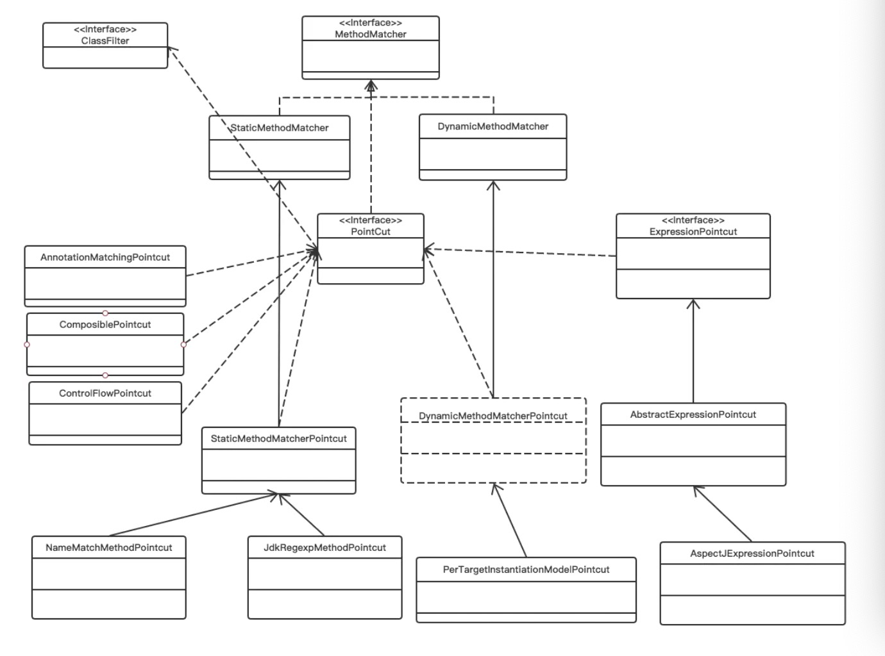
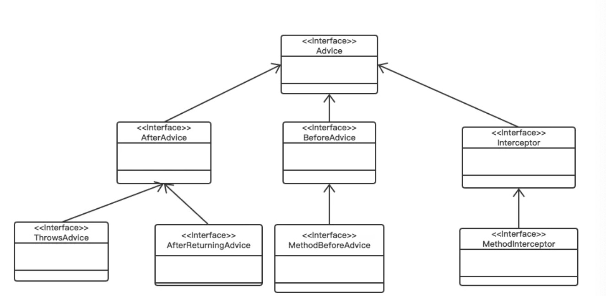
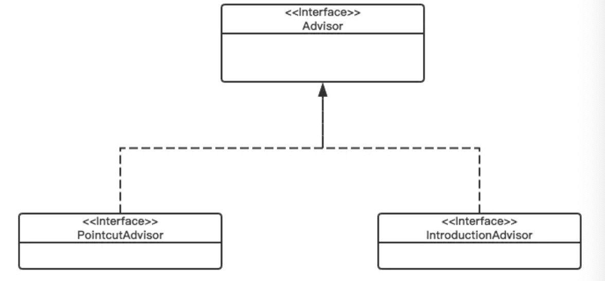
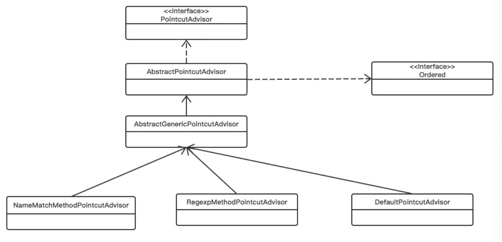
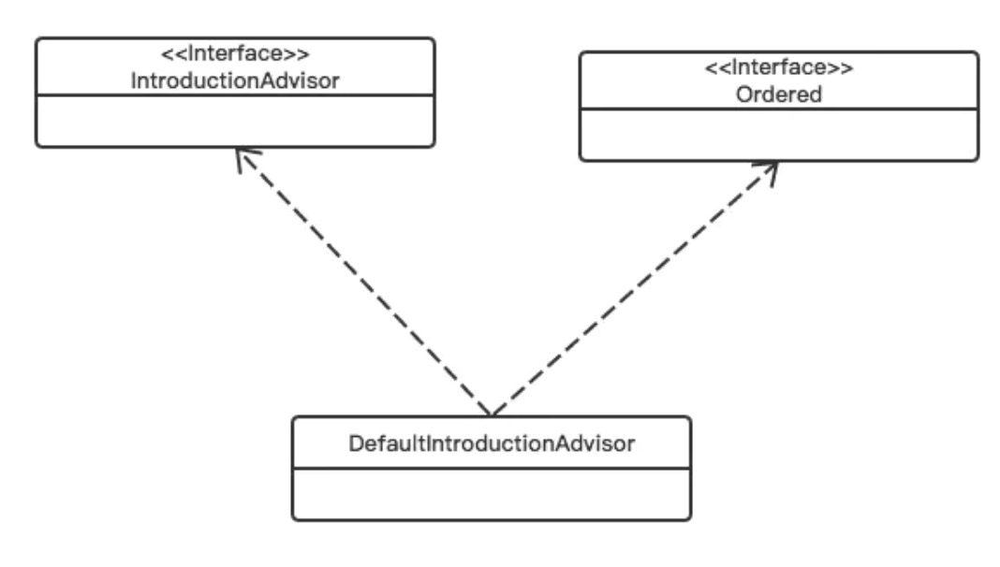
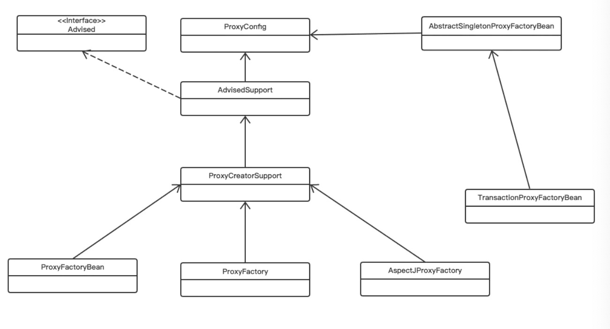

写了很多篇文章了，但写的文章大家都反映平平（但我却感觉是自己的呕心沥血之作），是时候改变一下写作技巧了，希望能通过一种愉快的方式使大家学到最多的知识。
以前写的文章直接上源码分析，这会让不了解的人看着很累，得不到想要的效果。本篇文章则从背景-原理-使用-源码的顺序为大家解析。如果不希望深入了解，看到“使用”这个层次就足够了。希望大家能愉快地看完这篇文章,多少给点反馈呗

# 一、AOP

## AOP 产生的背景

“存在即合理”，任何一种理论或技术的产生，必然有它的原因。了解它产生的背景、为了解决的问题有助于我们更好地把握AOP的概念。
软件开发一直在寻求一种高效开发、护展、维护的方式。从面向过程的开发实践中，前人将关注点抽象出来，对行为和属性进行聚合，形成了面向对象的开发思想，其在一定程度上影响了软件开发的过程。鉴于此，我们在开发的过程中会对软件开发进行抽象、分割成各个模块或对象。例如，我们会对API进行抽象成四个模块：Controller,Service,Gateway,Command.这很好地解决了业务级别的开发，但对于系统级别的开发我们很难聚焦。比如、对于每一个模块需要进行打日志、代码监控、异常处理。以打日志为例，我只能将日志代码嵌套在各个对象上，而无法关注日志本身，而这种现象又偏离了OOP思想。






为了能够更好地将系统级别的代码抽离出来，去掉与对象的耦合，就产生了面向AOP（面向切面）。如上图所示，OOP属于一种横向扩展，AOP是一种纵向扩展。AOP依托于OOP，进一步将系统级别的代码抽象出来，进行纵向排列，实现低耦合。
至于AOP的确切的概念，我不希望给出抽象复杂的表述，只需要了解其作用即可。


# 1.2 AOP 的家庭成员

## 1.2.1 PointCut

即在哪个地方进行切入,它可以指定某一个点，也可以指定多个点。
比如类A的methord函数，当然一般的AOP与语言（AOL）会采用多用方式来定义PointCut,比如说利用正则表达式，可以同时指定多个类的多个函数。

## 1.2.2 Advice

在切入点干什么，指定在PointCut地方做什么事情（增强），打日志、执行缓存、处理异常等等。

## 1.2.3 Advisor/Aspect

PointCut + Advice 形成了切面Aspect，这个概念本身即代表切面的所有元素。但到这一地步并不是完整的，因为还不知道如何将切面植入到代码中，解决此问题的技术就是PROXY

## 1.2.4 Proxy

Proxy 即代理，其不能算做AOP的家庭成员，更相当于一个管理部门，它管理 了AOP的如何融入OOP。之所以将其放在这里，是因为Aspect虽然是面向切面核心思想的重要组成部分，但其思想的践行者却是Proxy,也是实现AOP的难点与核心据在。

# 二、AOP的技术实现Proxy

AOP仅仅是一种思想，那为了让这种思想发光，必然脱离语言本身的技术支持，Java在实现该技术时就是采用的代理Proxy,那我们就去了解一下，如何通过代理实现面向切面

## 1.静态代理





就像我们去买二手房要经过中介一样，房主将房源委托给中介，中介将房源推荐给买方。中间的任何手续的承办都由中介来处理，不需要我们和房主直接打交道。无论对买方还是卖房都都省了很多事情，但同时也要付出代价，对于买房当然是中介费，对于代码的话就是性能。下面我们来介绍实现AOP的三种代理方式。
下面我就以买房的过程中需要打日志为例介绍三种代理方式
静态和动态是由代理产生的时间段来决定的。静态代理产生于代码编译阶段，即一旦代码运行就不可变了。下面我们来看一个例子


```
public interface IPerson {
    public void doSomething();
}复制代码
public class Person implements IPerson {
    public void doSomething(){
        System.out.println("I want wo sell this house");
    }
}复制代码
public class PersonProxy {
    private IPerson iPerson;
    private final static Logger logger = LoggerFactory.getLogger(PersonProxy.class);

    public PersonProxy(IPerson iPerson) {
        this.iPerson = iPerson;
    }
    public void doSomething() {
        logger.info("Before Proxy");
        iPerson.doSomething();
        logger.info("After Proxy");
    }

    public static void main(String[] args) {
        PersonProxy personProxy = new PersonProxy(new Person());
        personProxy.doSomething();
    }
}复制代码
```

通过代理类我们实现了将日志代码集成到了目标类，但从上面我们可以看出它具有很大的局限性：需要固定的类编写接口（或许还可以接受，毕竟有提倡面向接口编程），需要实现接口的每一个函数（不可接受），同样会造成代码的大量重复，将会使代码更加混乱。

## 2.动态代理

那能否通过实现一次代码即可将logger织入到所有函数中呢，答案当然是可以的，此时就要用到java中的反射机制

```
public class PersonProxy implements InvocationHandler{
    private Object delegate;
    private final Logger logger = LoggerFactory.getLogger(this.getClass();

    public Object bind(Object delegate) {
        this.delegate = delegate;
        return Proxy.newProxyInstance(delegate.getClass().getClassLoader(), delegate.getClass().getInterfaces(), this);
    }
    public Object invoke(Object proxy, Method method, Object[] args) throws Throwable {
        Object result = null;
        try {
            logger.info("Before Proxy");
            result = method.invoke(delegate, args);
            logger.info("After Proxy");
        } catch (Exception e) {
            throw e;
        }
        return result;
    }

    public static void main(String[] args) {
        PersonProxy personProxy = new PersonProxy();
        IPerson iperson = (IPerson) personProxy.bind(new Person());
        iperson.doSomething();
    }
}复制代码
```

它的好处理时可以为我们生成任何一个接口的代理类，并将需要增强的方法织入到任意目标函数。但它仍然具有一个局限性，就是只有实现了接口的类，才能为其实现代理。

## 3.CGLIB

CGLIB解决了动态代理的难题，它通过生成目标类子类的方式来实现来实现代理，而不是接口，规避了接口的局限性。
CGLIB是一个强大的高性能代码生成包（[生成原理](http://blog.csdn.net/qq_25689397/article/details/51427164)还没研究过），其在运行时期（非编译时期）生成被 代理对象的子类，并重写了被代理对象的所有方法，从而作为代理对象。

```
public class PersonProxy implements MethodInterceptor {
    private Object delegate;
    private final Logger logger = LoggerFactory.getLogger(this.getClass());

    public Object intercept(Object proxy, Method method, Object[] args,  MethodProxy methodProxy) throws Throwable {
        logger.info("Before Proxy");
        Object result = methodProxy.invokeSuper(method, args);
        logger.info("After Proxy");
        return result;
    }

    public static Person getProxyInstance() {
        Enhancer enhancer = new Enhancer();
        enhancer.setSuperclass(Person.class);

        enhancer.setCallback(new PersonProxy());
        return (Person) enhancer.create();
    }
}复制代码
```

当然CGLIB也具有局限性，对于无法生成子类的类（final类），肯定是没有办法生成代理子类的。

以上就是三种代理的实现方式，但千成别被迷惑了，在Spring AOP中这些东西已经被封装了，不需要我们自己实现。要不然得累死，但了解AOP的实现原理（即基于代理）还是很有必要的。

# 三、应用

先建一个目标类（这个类我自己都恶心），还是卖房子的事，讨论价格，直接写死了，意思意思……

```
public class Person {
    public int tradePrice () {
        return 1000;
    }
}复制代码
```

继承MethodInteceptor来实现一个Advisor,当然可选择的有不少，下面都有介绍，也在这里意思意思……

```
public class LogsInterceptor implements MethodInterceptor {
    Logger logger = LoggerFactory.getLogger(this.getClass().getName());
    public Object invoke(MethodInvocation invocation) throws Throwable {
        try {
            logger.info("Start bargaining....");
            Object returnValue = invocation.proceed();
        } catch (Exception e) {
            throw e;
        } finally {
            logger.info("Bargaining Over");
        }
        return null;
    }
}复制代码
```

## 3.1.        配置ProxyFactoryBean，显式地设置pointCut,advice,advisor

一个个地配置就可以了，这样虽然麻烦，但是你知道原理呀……

```
<bean id="pointCut" class="org.springframework.aop.support.NameMatchMethodPointcut">
    <property name="mappedName" value="tradePrice"/>
</bean>
<bean id="myInterceptor" class="com.sankuai.meituan.meishi.poi.tag.LogsInterceptor"></bean>
<bean id="myAdvisor" class="org.springframework.aop.support.DefaultPointcutAdvisor">
    <property name="pointcut" ref="pointCut"/>
    <property name="advice" ref="myInterceptor"/>
</bean>
<bean id="myProxy" class="org.springframework.aop.framework.ProxyFactoryBean">
    <property name="interceptorNames">
        <list>
            <value>myAdvisor</value>
        </list>
    </property>
</bean>复制代码
```

但上面这个恶心的地方在于，你得一个个地指定义advisor,有几个目标pointCut,你就得定义几次，这还不得恶心死

## 3.2.        配置AutoProxyCreator，这种方式下，还是如以前一样使用定义的bean，但是从容器中获得的其实已经是代理对象

为了解决上面的问题AutoProxyCreator 有两个具体的实现类BeanNameAutoProxyCreator和DefaultAdvisorAutoProxyCreator,先拿一个练练手

```
<bean id="pointCut1" class="org.springframework.aop.support.NameMatchMethodPointcut">
    <property name="mappedName" value="tradePrice"/>
</bean>
<bean id="pointCut2" class="org.springframework.aop.support.NameMatchMethodPointcut">
    <property name="mappedName" value="tradePrice"/>
</bean>
<bean id="myInterceptor" class="com.sankuai.meituan.meishi.poi.tag.LogsInterceptor"></bean>

<bean id="myProxy" class="org.springframework.aop.framework.autoproxy.BeanNameAutoProxyCreator">
    <property name="beanNames">
        <list>
            <value>pointCut1</value>
            <value>pointCut2</value>
        </list>
    </property>
    <property name="interceptorNames">
        <list>
            <value>myInterceptor</value>
        </list>
    </property>
</bean>复制代码
```

是不是感觉好多了，但大家都不喜欢写这么东西（不过我还是推荐采用这种配置的）

## 3.3. 通过aop:config来配置

[大家参考一下吧，不推荐](http://www.cnblogs.com/leiOOlei/p/3709607.html)

## 3.4.        通过来配置，使用AspectJ的注解来标识通知及切入点

引入aspectj就可用aspect的注解来实现了，这个才是只关注切面本身就可以了

```
public class MyAspect {
    private final Logger logger = LoggerFactory.getLogger(this.getClass());

    @Pointcut("execution(public void *.method1)")
    public void pointcutName(){}

    @Around("pointcutName()")
    public Object performanceTrace(ProceedingJoinPoint proceedingJoinPoint) throws Throwable {
        try {
            logger.info("log.....");
            return proceedingJoinPoint.proceed();

        } finally {
            logger.info("log end");
        }
    }
}复制代码
```

切面的代理生成就靠它了……

```
<aop:aspectj-autoproxy></aop:aspectj-autoproxy>复制代码
```

aspectj的功能是非常强大的，其定义语法和运算这里就不再深入了，不是本文的重点

# 四、深度分析

Spring AOP是AOL家庭Loser 也是winner,遵循大道至简。Spring AOP只支持部分AOP的功能，作为一个轻量级框架，实现了AOP20%的技术，支撑80%的需求，虽然对AspectJ进行了集成，但其内部原理仍然使用是是Spring AOP，所以也只能使用AspectJ的部分功能。

## 4.1 Spring Aop的家庭成员

以下内容仅局限于Spring Aop,而不包括其它AOL（Spring Aop相对于其它AOL功能简单的多，但也预留了对其它AOL的支持）

### 4.1.1 PointCut





我们来看一下PointCut的类图，以PointCut接口为核心进行扩展
PointCut 依赖了ClassFilter和MethodMatcher,ClassFilter用来指定特定的类，MethodMatcher 指定特定的函数，正是由于PointCut仅有的两个依赖，它只能实现函数级别的AOP。对于属性、for语句等是无法实现该切点的。
MethodMatcher 有两个实现类StaticMethodMatcher和DynamicMethodMatcher，它们两个实现的唯一区别是isRuntime(参考下面的源码)。StaticMethodMatcher不在运行时检测，DynamicMethodMatcher要在运行时实时检测参数，这也会导致DynamicMethodMatcher的性能相对较差。


```
public abstract class StaticMethodMatcher implements MethodMatcher {

   @Override
   public final boolean isRuntime() {
      return false;
   }

   @Override
   public final boolean matches(Method method, Class<?> targetClass, Object[] args) {
      // should never be invoked because isRuntime() returns false
      throw new UnsupportedOperationException("Illegal MethodMatcher usage");
   }
}复制代码
public abstract class DynamicMethodMatcher implements MethodMatcher {

   @Override
   public final boolean isRuntime() {
      return true;
   }

   /**
    * Can override to add preconditions for dynamic matching. This implementation
    * always returns true.
    */
   @Override
   public boolean matches(Method method, Class<?> targetClass) {
      return true;
   }

}复制代码
```

类似继承于StaticMethodMatcher和DynamicMethodMatcher也有两个分支StaticMethodMatcherPointcut和DynamicMethodMatcherPointcut，StaticMethodMatcherPointcut是我们最常用，其具体实现有两个NameMatchMethodPointcut和JdkRegexpMethodPointcut，一个通过name进行匹配，一个通过正则表达式匹配。
有必要对另外一个分支说一下ExpressionPointcut，它的出现是了对AspectJ的支持，所以其具体实现也有AspectJExpressionPointcut
最左边的三个给我们提供了三个更强功能的PointCut
AnnotationMatchingPointcut:可以指定某种类型的注解
ComposiblePointcut：进行与或操作
ControlFlowPointcut：这个有些特殊，它是一种控制流，例如类A 调用B.method()，它可以指定当被A调用时才进行拦截。

### 3.1.2 Advice

我们来看一下Advice 的类图,先看一下接口的分类：




AfterAdvice是指函数调用结束之后增强，它又包括两种情况：异常退出和正常退出；BeforeAdvice指函数调用之前增强；Inteceptor有点特殊，它是由AOP联盟定义的标准，也是为了方便Spring AOP 扩展，以便对其它AOL支持。Interceptor有很多扩展，比如Around Advice的功能实现(具体实现是Advisor的内容了，接下来再看)


### 3.1.3 Advisor

同样Advisor按照Advice去分也可以分成两条线路，一个是来源于Spring AOP 的类型，一种是来自AOP联盟的Interceptoor, IntroductionAdvisor就是对MethodInterceptor的继承和实现





所以接下类我们还是分成两类来研究其具体实现:
Spring AOP的PointcutAdvisor





AbstractPointcutAdvisor 实现了Ordered,为多个Advice指定顺序，顺序为Int类型，越小优先级越高,
AbstractGenericPointcutAdvisor 指定了Advice，除了Introduction之外的类型
下面具体的Advisor实现则对应于PointCut 的类型，具体指定哪个pointCut,

Introduction类型，与上面的基本类似，不再介绍了




### 3.1.4 Proxy

这一节才最关键，它决定了如何具体实现AOP，所以这一节也将会难理解一些,
先看一下类图，看起来也挺简单





ProxyConfig设置了几个参数


```
private boolean proxyTargetClass = false;

private boolean optimize = false;

boolean opaque = false;

boolean exposeProxy = false;

private boolean frozen = false;复制代码
```

private boolean proxyTargetClass = false;
代理有两种方式：一种是接口代理（上文提到过的动态代理），一种是CGLIB。默认有接口的类采用接口代理，否则使用CGLIB。如果设置成true,则直接使用CGLIB；
原文注释如下

```
/**
 * Set whether to proxy the target class directly, instead of just proxying
 * specific interfaces. Default is "false".
 * <p>Set this to "true" to force proxying for the TargetSource's exposed
 * target class. If that target class is an interface, a JDK proxy will be
 * created for the given interface. If that target class is any other class,
 * a CGLIB proxy will be created for the given class.
 * <p>Note: Depending on the configuration of the concrete proxy factory,
 * the proxy-target-class behavior will also be applied if no interfaces
 * have been specified (and no interface autodetection is activated).
 * @see org.springframework.aop.TargetSource#getTargetClass()
 */复制代码
```

 private boolean optimize = false;是否进行优化，不同代理的优化一般是不同的。如代理对象生成之后，就会忽略Advised的变动。

```
/**
 * Set whether proxies should perform aggressive optimizations.
 * The exact meaning of "aggressive optimizations" will differ
 * between proxies, but there is usually some tradeoff.
 * Default is "false".
 * <p>For example, optimization will usually mean that advice changes won't
 * take effect after a proxy has been created. For this reason, optimization
 * is disabled by default. An optimize value of "true" may be ignored
 * if other settings preclude optimization: for example, if "exposeProxy"
 * is set to "true" and that's not compatible with the optimization.
 */复制代码
```

 opaque 是否强制转化为advised

```
/**
 * Set whether proxies created by this configuration should be prevented
 * from being cast to {@link Advised} to query proxy status.
 * <p>Default is "false", meaning that any AOP proxy can be cast to
 * {@link Advised}.
 */复制代码
```

 exposeProxy:AOP生成对象时，绑定到ThreadLocal,  可以通过AopContext获取

```
 /**
 * Set whether the proxy should be exposed by the AOP framework as a
 * ThreadLocal for retrieval via the AopContext class. This is useful
 * if an advised object needs to call another advised method on itself.
 * (If it uses {@code this}, the invocation will not be advised).
 * <p>Default is "false", in order to avoid unnecessary extra interception.
 * This means that no guarantees are provided that AopContext access will
 * work consistently within any method of the advised object.
 */复制代码
```

frozen：代理信息一旦设置，是否允许改变

```
/**
 * Set whether this config should be frozen.
 * <p>When a config is frozen, no advice changes can be made. This is
 * useful for optimization, and useful when we don't want callers to
 * be able to manipulate configuration after casting to Advised.
 */复制代码
```

AdvisedSupport则的作用是设置生成代理对象所需要的全部信息。

ProxyCreatorSupport则完成生成代理的相关工作。
至于它们两个具体做了哪些工作，这里不展开讲了，因为内容很多，不同的advisor和pointCut所进行的操作封装有所不同， 在使用到的时候再仔细看源码，很容易看懂。

# 五、最佳实践

那什么时候来使用AOP呢？我就私自定义一下：当一个功能和对象本身没有必段关系，重复出现在多个模块时，就应该用AOP来解耦。
有人总结了一下使用情景（[参考](http://blog.csdn.net/moreevan/article/details/11977115/)， 是否认同自己决定）：
Authentication 权限
Caching 缓存
Context passing 内容传递
Error handling 错误处理
Lazy loading　懒加载
Debugging　　调试
logging, tracing, profiling and monitoring　记录跟踪　优化　校准
Performance optimization　性能优化
Persistence　　持久化
Resource pooling　资源池
Synchronization　同步
Transactions 事务

## 5.1 日志

看了很多资料都是用日志做AOP的例子，其实这个并不太好，因为AOP很难完全实现log的行为，但对于某一类型的日志处理还是有用的。
例如：对Command的异常进行统一处理，对Controller层的请求进行打日志

## 5.2 代码性能测试

利用PerformanceMonitorInterceptor来协助应用性能优化, spring自带的

